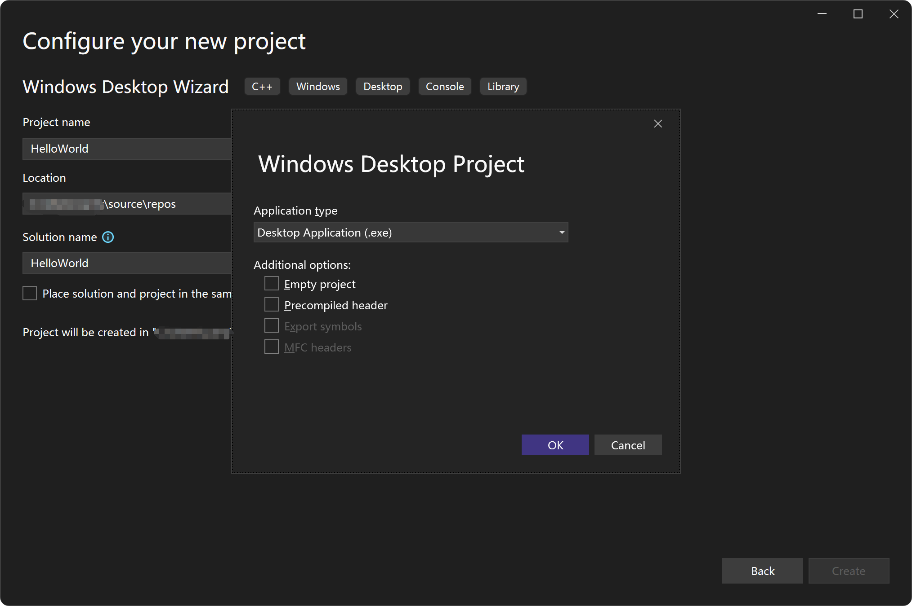
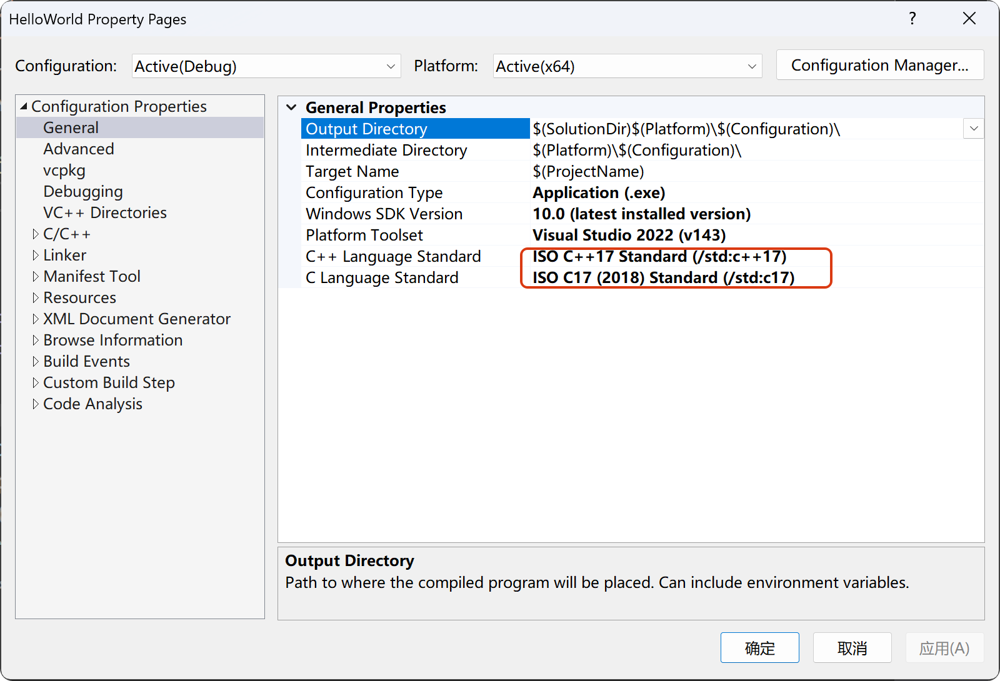
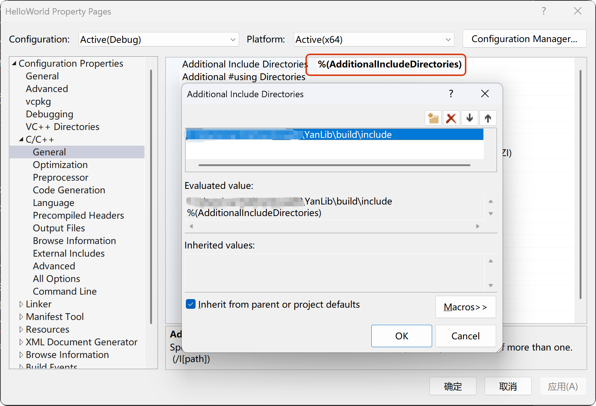
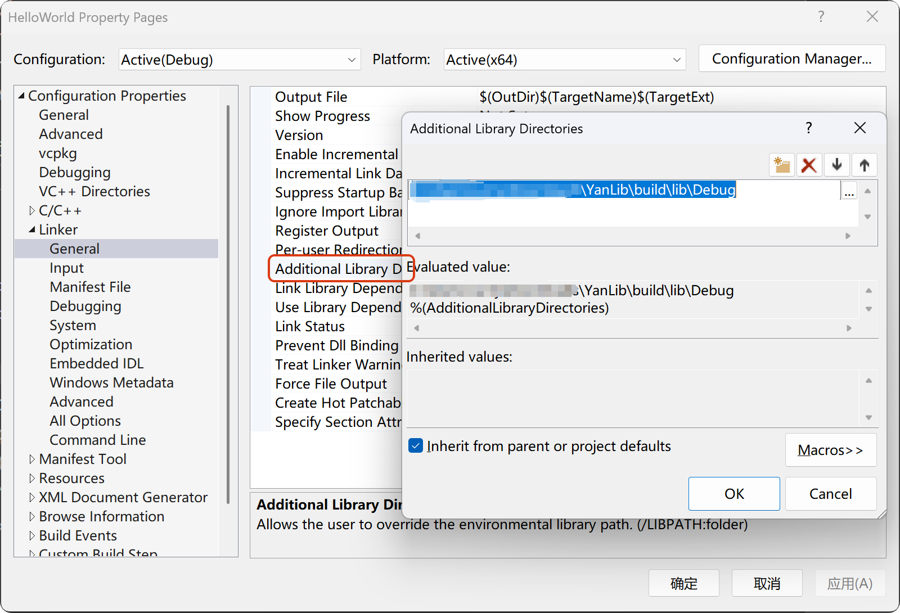
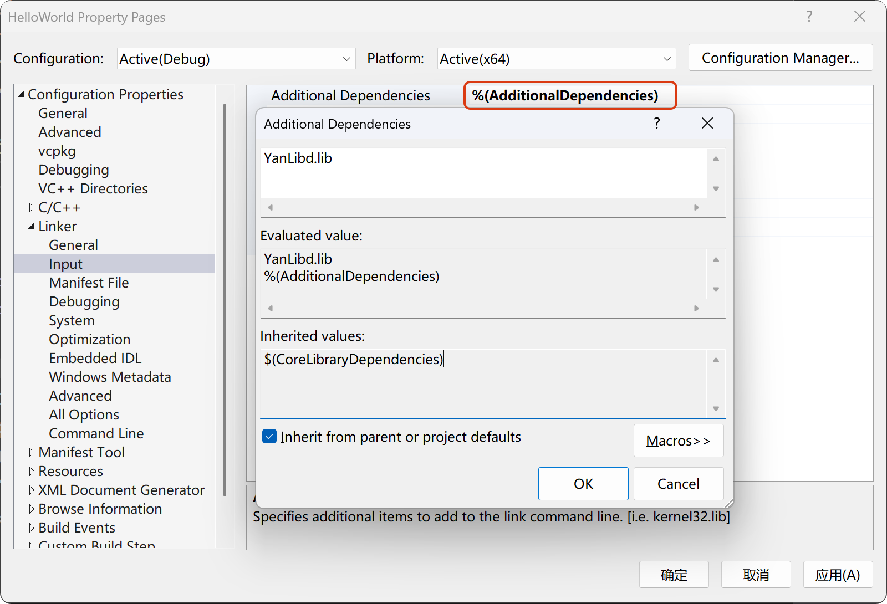
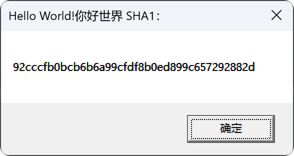

```text                
                                                                                     bbbbbbbb            
YYYYYYY       YYYYYYY                                 LLLLLLLLLLL               iiii b::::::b            
Y:::::Y       Y:::::Y                                 L:::::::::L              i::::ib::::::b            
Y:::::Y       Y:::::Y                                 L:::::::::L               iiii b::::::b            
Y::::::Y     Y::::::Y                                 LL:::::::LL                     b:::::b            
YYY:::::Y   Y:::::YYYaaaaaaaaaaaaa  nnnn  nnnnnnnn      L:::::L               iiiiiii b:::::bbbbbbbbb    
   Y:::::Y Y:::::Y   a::::::::::::a n:::nn::::::::nn    L:::::L               i:::::i b::::::::::::::bb  
    Y:::::Y:::::Y    aaaaaaaaa:::::an::::::::::::::nn   L:::::L                i::::i b::::::::::::::::b 
     Y:::::::::Y              a::::ann:::::::::::::::n  L:::::L                i::::i b:::::bbbbb:::::::b
      Y:::::::Y        aaaaaaa:::::a  n:::::nnnn:::::n  L:::::L                i::::i b:::::b    b::::::b
       Y:::::Y       aa::::::::::::a  n::::n    n::::n  L:::::L                i::::i b:::::b     b:::::b
       Y:::::Y      a::::aaaa::::::a  n::::n    n::::n  L:::::L                i::::i b:::::b     b:::::b
       Y:::::Y     a::::a    a:::::a  n::::n    n::::n  L:::::L         LLLLLL i::::i b:::::b     b:::::b
       Y:::::Y     a::::a    a:::::a  n::::n    n::::nLL:::::::LLLLLLLLL:::::Li::::::ib:::::bbbbbb::::::b
    YYYY:::::YYYY  a:::::aaaa::::::a  n::::n    n::::nL::::::::::::::::::::::Li::::::ib::::::::::::::::b 
    Y:::::::::::Y   a::::::::::aa:::a n::::n    n::::nL::::::::::::::::::::::Li::::::ib:::::::::::::::b  
    YYYYYYYYYYYYY    aaaaaaaaaa  aaaa nnnnnn    nnnnnnLLLLLLLLLLLLLLLLLLLLLLLLiiiiiiiibbbbbbbbbbbbbbbb                                                                                                     
```

[](https://img.shields.io/badge/license-MIT-blue)
[](https://img.shields.io/badge/C++-17-blue)
[](https://img.shields.io/badge/CMake-v3.30-blue)
[](https://img.shields.io/badge/GoogleTest-v1.16.0-blue)
[](https://img.shields.io/badge/Platform-Windows-blue)

**YanLib** is a Windows runtime library implemented in **C++** based on the **RAII** paradigm,
delivering fully automatic resource management while maintaining high performance and security.

The library currently encompasses seven core modules essential for **Win32** development:
**crypto**, **hash**, **io**, **mem**, **sync**, **sys**, and **ui**.

The **ui** module further includes three submodules: **core**, **gdi**, and **components**,
primarily responsible for Windows graphical interface handling.

## 🤔Why Create?

Despite undergoing several iterations across Windows operating systems,
the **Win32API** maintains exceptional compatibility and efficiency even in today's Windows 11.
However, its long history has resulted in verbose **Win32API**-based code that often causes resource leaks.
To ensure clean and secure coding practices for myself, I conceived the idea for this project several months ago.

## 💼Project Architecture

```text
src
├── crypto
├── hash
├── helper
├── io
├── mem
├── sync
├── sys
└── ui
    ├── components
    ├── core
    └── gdi
```

## 📜Detailed Information

+ 🏷️crypto module
    + 🔖aes codec
        - aes128
        - aes192
        - aes256
    + 🔖rsa codec
        - rsa384
        - rsa512
        - rsa768
        - rsa1024
        - rsa1536
        - rsa2048
        - rsa3072
        - rsa4096
        - rsa8192
        - rsa16384
    + 🔖base codec
        - base16
        - base32
        - base58
        - base62
        - base64
        - base85
        - base91
        - base92
        - base100
    + 🔖other codec
        - vigenere
        - uuencode
        - xxencode
+ 🏷️hash module
    - md5
    - sha1
    - sha256
    - sha384
    - sha512
+ 🏷️io module
    - fs (File and Directory)
    - comp_port (Completion Port)
    - ftp (FTP Client)
    - http (HTTP Client and HTTPS Client)
    - tcp_server (TCP Server)
    - tcp_client (TCP Client)
    - udp_server (UDP Server)
    - udp_client (UDP Client)
+ 🏷️mem module
    - allocate (Virtual Memory)
    - heap (Heap Memory)
    - mmap (Memory-Mapped)
+ 🏷️sync module
    - mutex
    - rwlock (Read-Write Lock)
    - condvar (Conditional Variable)
    - semaphore
    - barrier
    - fence
    - timer
    - event
+ 🏷️sys module
    - proc (Process)
    - thread
    - thread_pool
    - fiber
    - job
    - processor
    - security
    - snapshot
+ 🏷️ui module
    + 🔖core module
        - keyboard
        - mouse
        - touch
        - caret
        - accelerator
        - cursor
        - desktop
        - dialog
        - menu
        - clipboard
        - icon
        - image
        - message
        - notify
        - window
        - window_aware
        - window_behavior
        - window_class
        - window_hook
        - window_pos
        - window_prop
    + 🔖gdi module
        + 📌Core Object
            - dc(Device Context)
            - coordinate
            - palette
        + 📌Drawing Tools
            - pen
            - brush
            - font
        + 📌Basic Graphic
            - rect
            - line
            - arc
            - bezier
        + 📌Advance Graphic
            - shape
            - path
            - region
            - clip
        + 📌Content Drawing
            - text
            - paint
            - bitmap
        + 📌Display Device
            - display
            - monitor
        + 📌File Format
            - meta(Enhance Meta File)
    + 🔖components module
        + 📌Basic Controls
            - button
            - edit
            - label
            - link
        + 📌List Selection Controls
            - list_box
            - list_view
            - combo_box
            - tree
        + 📌Date and Time Controls
            - calendar
            - datetime
        + 📌Rich Text Control
            - rich_edit
        + 📌Professional Controls
            - header
            - hot_key
            - ip_addr
            - scroll
            - track
            - up_down
        + 📌Progress Status Control
            - progress
            - status
        + 📌Container Control
            - page
            - property
            - rebar
            - tab
        + 📌Interactive Controls
            - tool_bar
            - tool_tips
            - task_dialog
        + 📌Multimedia Controls
            - animate
            - image_list
        + 📌Other Control
            - general

## 🤔How to Use？

### Prepare the Environment

Install and configure **git-bash**, **clang-format**, **code editor** (**Visual Studio**, **Visual Studio Code**,
**Clion**, etc.), **CMake**, **MSVC compiler**.

### Build Source Code

All set. Proceed with the following steps:

```shell
git clone https://github.com/BinRacer/YanLib.git
cd YanLib
# Build and Run Debug
mkdir cmake-build-debug
cmake -S . -B cmake-build-debug
cmake --build cmake-build-debug --config Debug --target YanLib
cmake --build cmake-build-debug --config Debug
ctest --test-dir cmake-build-debug/test --output-on-failure -C Debug
# Build and Run Release
mkdir cmake-build-release
cmake -S . -B cmake-build-release
cmake --build cmake-build-release --config Release --target YanLib
cmake --build cmake-build-release --config Release
ctest --test-dir cmake-build-release/test --output-on-failure -C Release
```

After passing the tests, inspect the **build** and **dist** directories generated during the compilation.
The **build** directory contains public header files and library files,
while the **dist** directory stores the zipped archive of the build directory.

### Example

Unless otherwise specified, **Visual Studio** will be used as the code editor.

1. Open **Visual Studio 2022** code editor, select the **Windows Desktop Wizard**,
   and set the project name to **HelloWorld**.
   

2. Select the **HelloWorld** project, right-click it, and choose **Properties** from the context menu.
   Navigate to **Configuration Properties > General > C++ Language Standard** and set it to **ISO C++17 Standard (/std:
   c++17)**.
   Then go to **Configuration Properties > General > C Language Standard** and select **ISO C17 (2018) Standard (/std:
   c17)**.
   

3. Navigate to **Configuration Properties > Advanced > Character Set** and select **Use Unicode Character Set**.
   

4. Navigate to **Configuration Properties > C/C++ > General**, select **Additional Include Directories**, click the Edit
   button, and add the full path to the generated header files directory – specifically **build\include**.
   

5. Navigate to **Configuration Properties > Linker > General**, select **Additional Library Directories**, click the
   Edit button, and add the full path to the generated library directory – specifically **build\lib\Debug**.
   

6. Navigate to **Configuration Properties > Linker > Input**, select **Additional Dependencies**, click the Edit button,
   and add the built library filename: **YanLibd.lib**.
   

7. After completing the file modifications above, save your changes by clicking Apply followed by OK to ensure
   configuration updates take effect. Then clear the content of the auto-generated HelloWorld.cpp file and replace it
   with the following code:

```c++
// HelloWorld.cpp : Defines the entry point for the application.
//

#include "framework.h"
#include "HelloWorld.h"
#include <hash/sha1.h>
#include <helper/convert.h>
namespace hash = YanLib::hash;
namespace helper = YanLib::helper;

int APIENTRY wWinMain(_In_ HINSTANCE hInstance,
                     _In_opt_ HINSTANCE hPrevInstance,
                     _In_ LPWSTR    lpCmdLine,
                     _In_ int       nCmdShow)
{
    UNREFERENCED_PARAMETER(hPrevInstance);
    UNREFERENCED_PARAMETER(lpCmdLine);

    auto data_str = L"Hello World!你好世界";
    auto convert = helper::convert::wstr_to_str(data_str,
        helper::CodePage::UTF8);
    hash::sha1 sha1(convert);
    auto result = sha1.hash_wstring();
    MessageBox(NULL, result.data(), L"Hello World!你好世界 SHA1：", MB_OK);
}
```

Select the Solution in Solution Explorer, right-click it, and choose **Rebuild Solution**. Then navigate to the Debug
menu and select **Start Without Debugging** 🎉 – alternatively, press **Ctrl+F5**.


