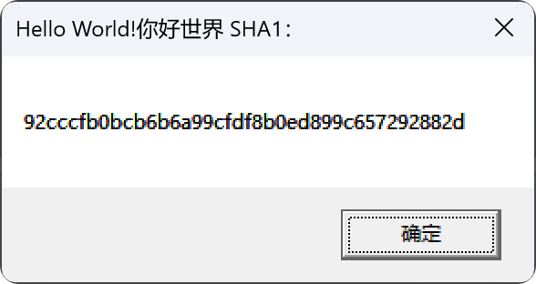

<div align="center">
  <a href="https://github.com/BinRacer/YanLib">
    
  </a>
  <div style="margin-top:-3rem; line-height:1; padding:0">
    
    
    
  </div>
</div>
<div align="center">

English | [简体中文](./README.zh-CN.md)

</div>

---

### 🚀 Project Overview
**YanLib** is a native Windows library built on modern C++ RAII paradigms. It guarantees zero-resource-leak through automated resource management while preserving native performance with memory safety.

---

### ✨ Core Features
- **⛓️ Automated Resource Management**：Eliminates manual release risks via RAII philosophy
- **⚡ Native Performance Efficiency**：Direct Win32 API wrappers without middleware overhead
- **🧩 Modular Architecture**：Decoupled components for selective integration
- **🧵 Thread Safety Guaranteed**：Built-in thread-safe mechanisms for all components

---

### 📦 Functional Modules Overview
| **Module**   | **Description**                   | **Key Components**                                             |
|--------------|-----------------------------------|----------------------------------------------------------------|
| **Crypto**   | Cryptography Algorithms          | AES/RSA/Base Series Codecs (Base16/32/58/62/64/85/91/92/100)   |
| **Hash**     | Hashing Implementations          | MD5, SHA1, SHA256, SHA384, SHA512                              |
| **IO**       | Network & Storage Operations      | Filesystem, Completion Ports, TCP/UDP Services                 |
| **Mem**      | Advanced Memory Management        | Virtual Allocation, Heap Optimization, Memory-mapped Files     |
| **Sync**     | Concurrency Primitives           | Mutexes, RW-Locks, Semaphores, Barriers, Timers, Events        |
| **Sys**      | System Interface Wrappers        | Process/Thread/Fiber Control, Security Policies, CPU Management |
| **UI**       | GUI Framework                    | Core (Window/Msg), GDI (Rendering), Components (Controls)      |

---

### 🧠 Design Philosophy
#### Solving Win32 Development Pain Points
Traditional **Win32API** development faces dual challenges:
1. **Cumbersome Boilerplate** - Elementary operations require repetitive coding
2. **Leakage Vulnerabilities** - Manual resource release prone to errors  
   **YanLib** addresses these with modern C++:
- ✅ Auto-release for GDI objects, handles, memory
- ✅ Type-safe API wrappers prevent conversion errors
- ✅ Fluent interface design simplifies complex workflows

---

### 🏗️ Project Structure
```text
src
├── crypto          # AES/RSA/Base Codecs
├── hash            # Hashing Algorithms
├── helper          # Utilities (Text Encoding, etc.)
├── io              # File/Network 
├── mem             # Virtual/Heap/Mapped Memory  
├── sync            # Sync Primitives (Mutex/Semaphore)  
├── sys             # Process/Thread/Security  
└── ui              # GUI Framework  
    ├── components  # Controls (Button/List/Dialog)  
    ├── core        # Window Management/Message Loop  
    └── gdi         # Graphics (Path/Region/Text)  
```

---

### 🚀 Getting Started
#### Prerequisites
- **Compiler**: MSVC 2019+ or Clang 12+
- **Build Tools**: CMake ≥ 3.30
- **Dependencies**: Windows SDK 10.0+

#### Build Commands
```bash
git clone https://github.com/BinRacer/YanLib.git
cd YanLib

# Debug Build
mkdir cmake-build-debug
cmake -S . -B cmake-build-debug
cmake --build cmake-build-debug --config Debug --target YanLib
cmake --build cmake-build-debug --config Debug
ctest --test-dir cmake-build-debug/test --output-on-failure -C Debug

# Release Build
mkdir cmake-build-release
cmake -S . -B cmake-build-release
cmake --build cmake-build-release --config Release --target YanLib
cmake --build cmake-build-release --config Release
ctest --test-dir cmake-build-release/test --output-on-failure -C Release
```

#### IDE Integration (Visual Studio)
1. **Include Directories**: Add `build/include`
2. **Library Directories**: Add `build/lib/(Debug|Release)`
3. **Linker Input**: Add `YanLibd.lib(Debug)` or `YanLib.lib(Release)`

#### Sample Code
```cpp
#include "framework.h"
#include "HelloWorld.h"
#include <hash/sha1.h>
#include <helper/convert.h>
namespace hash = YanLib::hash;
namespace helper = YanLib::helper;

int APIENTRY wWinMain(_In_ HINSTANCE hInstance,
                     _In_opt_ HINSTANCE hPrevInstance,
                     _In_ LPWSTR    lpCmdLine,
                     _In_ int       nCmdShow)
{
    UNREFERENCED_PARAMETER(hPrevInstance);
    UNREFERENCED_PARAMETER(lpCmdLine);

    auto data_str = L"Hello World!你好世界";
    auto convert = helper::convert::wstr_to_str(data_str,
        helper::CodePage::UTF8);
    hash::sha1 sha1(convert);
    auto result = sha1.hash_wstring();
    MessageBox(NULL, result.data(), L"Hello World!你好世界 SHA1：", MB_OK);
}
```
> **Output**: Dialog displays SHA1 digest of `Hello World!你好世界`


---