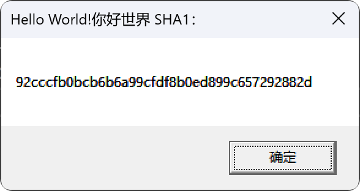

<div align="center">
  <a href="https://github.com/BinRacer/YanLib">
    
  </a>
  <div style="margin-top:-3rem; line-height:1; padding:0">
    
    
    
  </div>
</div>
<div align="center">

[English](./README.md) | 简体中文

</div>

---

### 🚀 项目概述
**YanLib** 是基于现代 C++ RAII 范式构建的 Windows 原生库，通过自动资源管理实现零泄漏保障，在保持原生性能的同时提供内存安全。

---

### ✨ 核心特性
- **⛓️ 资源自动化管理**：基于 RAII 理念消除手动释放风险
- **⚡ 高效原生性能**：直接封装 Win32 API，无中间层损耗
- **🧩 模块化设计**：解耦功能模块，支持按需集成
- **🧵 线程安全保障**：所有组件均内置线程安全机制

---

### 📦 功能模块概览
| **模块**    | **功能描述**                  | **关键组件**                                            |
|-------------|-------------------------------|-----------------------------------------------------|
| **Crypto**  | 加密算法库                    | AES/RSA/Base 系列编解码（Base16/32/58/62/64/85/91/92/100） |
| **Hash**    | 哈希算法实现                  | MD5, SHA1, SHA256, SHA384, SHA512                   |
| **IO**      | 网络与存储操作                | 文件系统、完成端口、TCP/UDP 服务                                |
| **Mem**     | 高级内存管理                  | 虚拟内存分配、堆内存优化、内存映射文件                                 |
| **Sync**    | 并发控制原语                  | 互斥锁、读写锁、信号量、屏障、定时器、事件                               |
| **Sys**     | 系统接口封装                  | 进程/线程/纤程控制、安全策略、处理器管理、系统快照                          |
| **UI**      | 图形界面框架                  | Core（窗口/消息管理）、GDI（图形绘制）、Components（控件库）             |

---

### 🧠 开发理念
#### 解决 Win32 开发痛点
传统 **Win32API** 开发面临两大核心挑战：
1. **冗长模板代码** - 基础操作需大量重复性代码
2. **资源泄漏风险** - 手动管理资源释放易出错  
   **YanLib** 通过现代 C++ 范式实现：
- ✅ 自动释放 GDI 对象、句柄、内存等资源
- ✅ 类型安全的 API 封装减少类型转换错误
- ✅ 链式调用设计简化复杂操作流程

---

### 🏗️ 项目架构
```text
src
├── crypto          # AES/RSA/Base 编解码
├── hash            # 哈希算法实现
├── helper          # 工具函数（字符编码转换等）
├── io              # 文件/网络
├── mem             # 虚拟内存/堆内存/内存映射
├── sync            # 同步原语（互斥锁/信号量等）
├── sys             # 进程/线程/安全模块
└── ui              # UI 框架
    ├── components  # 控件库（按钮/列表/对话框）
    ├── core        # 窗口管理/消息循环
    └── gdi         # 图形绘制（路径/区域/文本）
```

---

### 🚀 快速开始
#### 环境准备
- **编译器**：MSVC 2019+ 或 Clang 12+
- **构建工具**：CMake ≥ 3.30
- **依赖库**：Windows SDK 10.0+

#### 构建命令
```bash
git clone https://github.com/BinRacer/YanLib.git
cd YanLib

# Debug 构建
mkdir cmake-build-debug
cmake -S . -B cmake-build-debug
cmake --build cmake-build-debug --config Debug --target YanLib
cmake --build cmake-build-debug --config Debug
ctest --test-dir cmake-build-debug/test --output-on-failure -C Debug

# Release 构建
mkdir cmake-build-release
cmake -S . -B cmake-build-release
cmake --build cmake-build-release --config Release --target YanLib
cmake --build cmake-build-release --config Release
ctest --test-dir cmake-build-release/test --output-on-failure -C Release
```

#### 项目集成（Visual Studio）
1. **附加包含目录** → 添加 `build/include`
2. **附加库目录** → 添加 `build/lib/(Debug|Release)`
3. **附加依赖项** → 添加 `YanLibd.lib(Debug)或YanLibd.lib(Release)`

#### 示例代码
```cpp
#include <YanLib/hash/sha1.h>
#include <YanLib/helper/convert.h>

int APIENTRY wWinMain(HINSTANCE, HINSTANCE, LPWSTR, int) {
    auto text = L"Hello World!你好世界";
    auto utf8 = YanLib::helper::convert::wstr_to_str(text); // UTF-8 转换
    auto sha1 = YanLib::hash::sha1(utf8).hash_wstring();    // SHA1 哈希计算
    MessageBox(nullptr, sha1.c_str(), L"文本哈希值", MB_OK);
}
```
> 输出效果：弹出对话框显示 `Hello World!你好世界` 的 SHA1 值。


---
