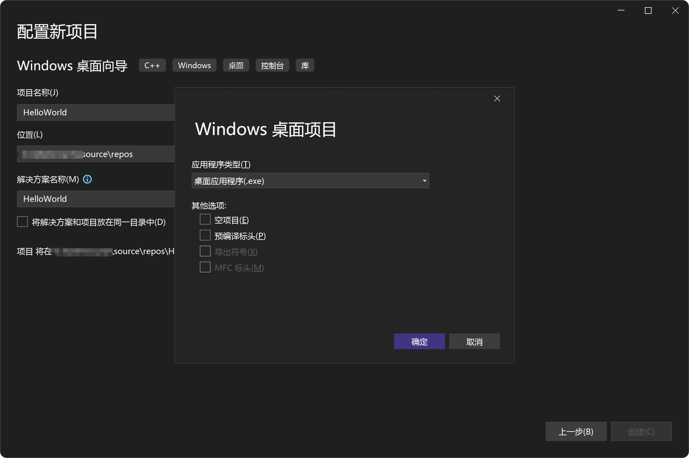
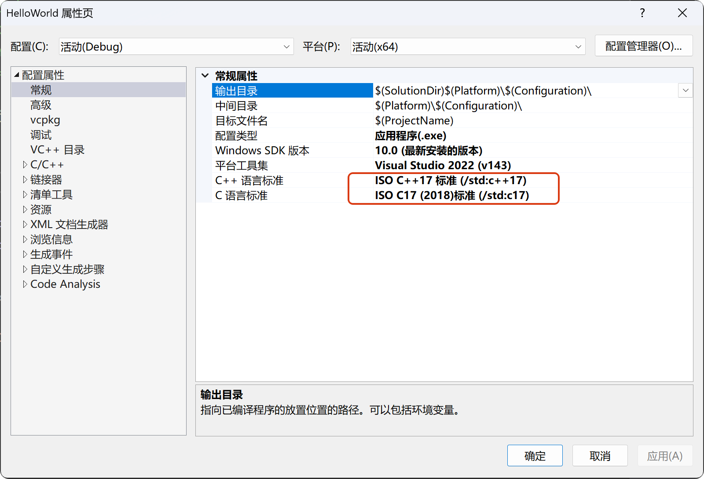
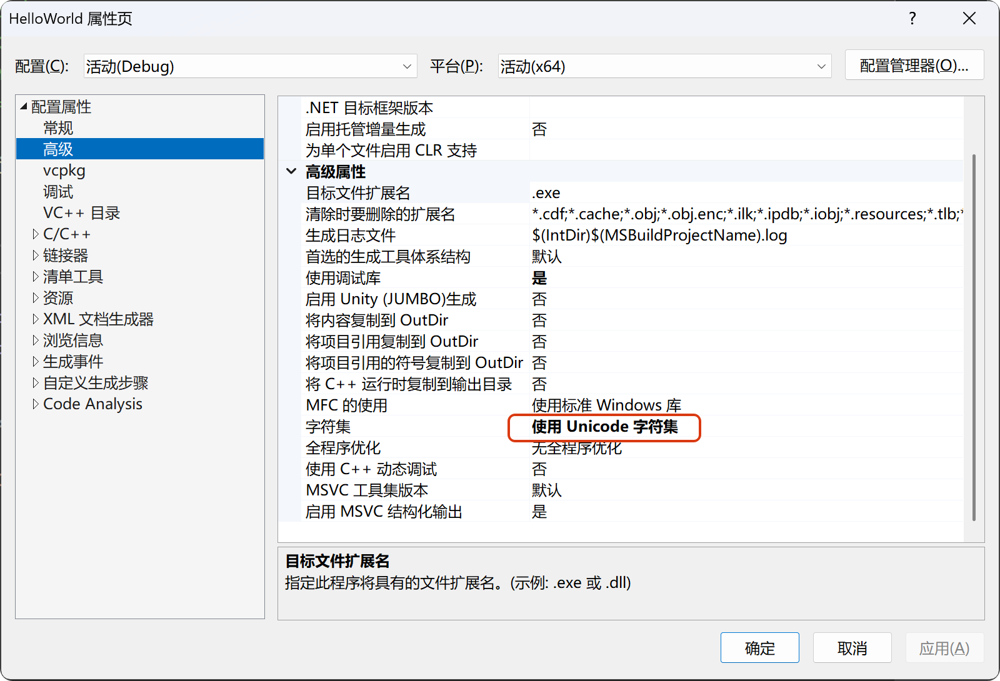
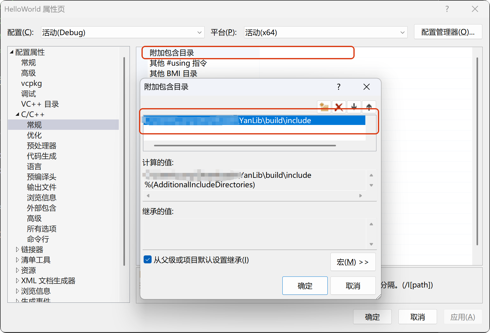
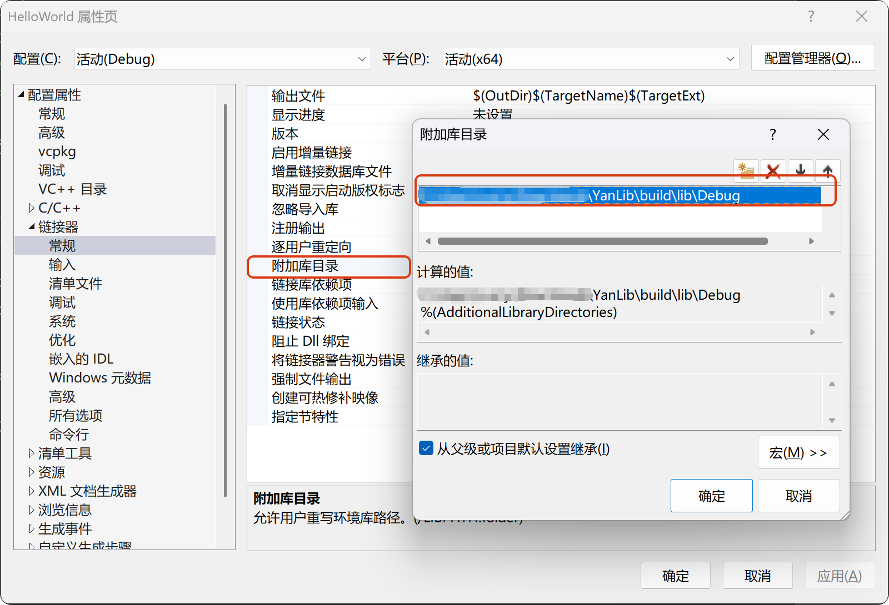
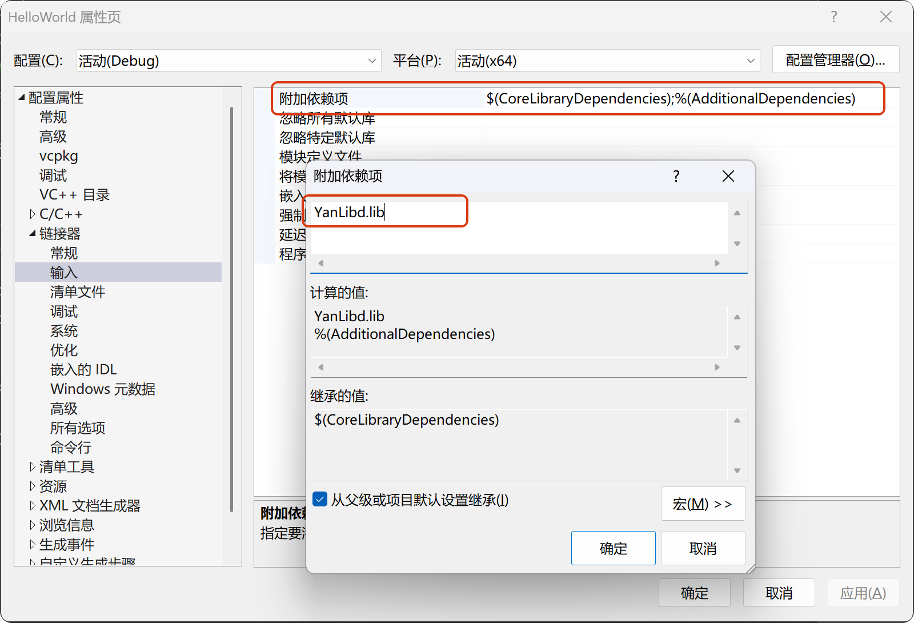

```text                
                                                                                     bbbbbbbb            
YYYYYYY       YYYYYYY                                 LLLLLLLLLLL               iiii b::::::b            
Y:::::Y       Y:::::Y                                 L:::::::::L              i::::ib::::::b            
Y:::::Y       Y:::::Y                                 L:::::::::L               iiii b::::::b            
Y::::::Y     Y::::::Y                                 LL:::::::LL                     b:::::b            
YYY:::::Y   Y:::::YYYaaaaaaaaaaaaa  nnnn  nnnnnnnn      L:::::L               iiiiiii b:::::bbbbbbbbb    
   Y:::::Y Y:::::Y   a::::::::::::a n:::nn::::::::nn    L:::::L               i:::::i b::::::::::::::bb  
    Y:::::Y:::::Y    aaaaaaaaa:::::an::::::::::::::nn   L:::::L                i::::i b::::::::::::::::b 
     Y:::::::::Y              a::::ann:::::::::::::::n  L:::::L                i::::i b:::::bbbbb:::::::b
      Y:::::::Y        aaaaaaa:::::a  n:::::nnnn:::::n  L:::::L                i::::i b:::::b    b::::::b
       Y:::::Y       aa::::::::::::a  n::::n    n::::n  L:::::L                i::::i b:::::b     b:::::b
       Y:::::Y      a::::aaaa::::::a  n::::n    n::::n  L:::::L                i::::i b:::::b     b:::::b
       Y:::::Y     a::::a    a:::::a  n::::n    n::::n  L:::::L         LLLLLL i::::i b:::::b     b:::::b
       Y:::::Y     a::::a    a:::::a  n::::n    n::::nLL:::::::LLLLLLLLL:::::Li::::::ib:::::bbbbbb::::::b
    YYYY:::::YYYY  a:::::aaaa::::::a  n::::n    n::::nL::::::::::::::::::::::Li::::::ib::::::::::::::::b 
    Y:::::::::::Y   a::::::::::aa:::a n::::n    n::::nL::::::::::::::::::::::Li::::::ib:::::::::::::::b  
    YYYYYYYYYYYYY    aaaaaaaaaa  aaaa nnnnnn    nnnnnnLLLLLLLLLLLLLLLLLLLLLLLLiiiiiiiibbbbbbbbbbbbbbbb                                                                                                     
```

[](https://img.shields.io/badge/license-MIT-blue)
[](https://img.shields.io/badge/C++-17-blue)
[](https://img.shields.io/badge/CMake-v3.30-blue)
[](https://img.shields.io/badge/GoogleTest-v1.16.0-blue)
[](https://img.shields.io/badge/Platform-Windows-blue)

**YanLib** 是一款基于 **C++** 的 **RAII** 的思想，实现完全的资源自动管理，而且运行保持高效而且安全的 **Windows** 运行库。

目前本库包含了七大常用的 **Win32** 开发所需的功能模块：**crypto**、**hash** 、**io**、**mem**、**sync**、**sys**、**ui**。

其中 **ui** 模块又包含 **core**、**gdi**、**components** 三个子模块，主要负责Windows图形界面操作。

## 🤔为什么开发？

**Win32API** 历经 Windows 操作系统若干版本迭代，时至今日的Win11，依然保持着极其优秀的兼容性和高效性。
但是，正因为其历史悠久，造成了基于 **Win32API** 编写的代码相当冗长而且容易造成资源泄露的问题出现。
为了自己可以干净安全的编写代码，于数月之前萌生了开发本项目的想法。

## 💼项目架构

```text
src
├── crypto
├── hash
├── helper
├── io
├── mem
├── sync
├── sys
└── ui
    ├── components
    ├── core
    └── gdi
```

## 📜详细信息

+ 🏷️crypto模块
    + 🔖aes编码解码
        - aes128
        - aes192
        - aes256
    + 🔖rsa编码解码
        - rsa384
        - rsa512
        - rsa768
        - rsa1024
        - rsa1536
        - rsa2048
        - rsa3072
        - rsa4096
        - rsa8192
        - rsa16384
    + 🔖base编码解码
        - base16
        - base32
        - base58
        - base62
        - base64
        - base85
        - base91
        - base92
        - base100
    + 🔖other编码解码
        - vigenere
        - uuencode
        - xxencode
+ 🏷️hash模块
    - md5编码
    - sha1编码
    - sha256编码
    - sha384编码
    - sha512编码
+ 🏷️io模块
    - fs （文件与目录）
    - comp_port （完成端口）
    - ftp （ftp客户端）
    - http （http和https客户端）
    - tcp_server （tcp服务器）
    - tcp_client （tcp客户端）
    - udp_server （udp服务器）
    - udp_client （udp客户端）
+ 🏷️mem模块
    - allocate （虚拟内存）
    - heap （堆内存）
    - mmap （内存映射）
+ 🏷️sync模块
    - mutex （互斥量）
    - rwlock （读写锁）
    - condvar （条件变量）
    - semaphore （信号量）
    - barrier （屏障）
    - fence （栅栏）
    - timer （计时器）
    - event （事件）
+ 🏷️sys模块
    - proc （进程）
    - thread （线程）
    - thread_pool （线程池）
    - fiber （纤程）
    - job （Job）
    - processor （处理器）
    - security （安全）
    - snapshot （快照）
+ 🏷️ui模块
    + 🔖core模块
        - keyboard （键盘）
        - mouse （鼠标）
        - touch （触摸板）
        - caret （插入符）
        - accelerator （加速键）
        - cursor （光标）
        - desktop （桌面）
        - dialog （对话框）
        - menu （菜单）
        - clipboard （剪贴板）
        - icon （图标）
        - image （图片）
        - message （消息）
        - notify （通知）
        - window （窗体）
        - window_aware （窗体感知）
        - window_behavior （窗体行为）
        - window_class （窗体类）
        - window_hook （窗体挂钩）
        - window_pos （窗体位置）
        - window_prop （窗体属性）
    + 🔖gdi模块
        + 📌核心对象
            - dc（设备上下文）
            - coordinate（坐标）
            - palette（调色板）
        + 📌绘图工具
            - pen（笔）
            - brush（画刷）
            - font（字体）
        + 📌基本图形
            - rect（矩形）
            - line（线）
            - arc（弧）
            - bezier（贝塞尔曲线）
        + 📌高级图形
            - shape（形状）
            - path（路径）
            - region（区域）
            - clip（裁剪）
        + 📌内容绘制
            - text（文本）
            - paint（绘画）
            - bitmap（位图）
        + 📌显示设备
            - display（显示器）
            - monitor（监视器）
        + 📌文件格式
            - meta（增强文件）
    + 🔖components模块
        + 📌基本控件
            - button （按钮）
            - edit （编辑框）
            - label （文本标签）
            - link （超链接）
        + 📌列表选择控件
            - list_box （列表框）
            - list_view （列表视图）
            - combo_box （组合框）
            - tree （树形视图）
        + 📌日期时间控件
            - calendar （日历）
            - datetime （ 日期时间选择器）
        + 📌富文本控件
            - rich_edit （富文本编辑框）
        + 📌专业控件
            - header （标题栏）
            - hot_key （热键输入）
            - ip_addr （IP地址输入框）
            - scroll （滚动条）
            - track （滑动条）
            - up_down （数值调节钮）
        + 📌进度状态控件
            - progress （进度条）
            - status （状态栏）
        + 📌容器控件
            - page （页）
            - property （属性表格）
            - rebar （伸缩工具栏）
            - tab （标签页）
        + 📌交互控件
            - tool_bar （工具栏）
            - tool_tips （工具提示）
            - task_dialog （任务对话框）
        + 📌多媒体控件
            - animate （动画控件）
            - image_list （图像列表）
        + 📌其他
            - general（通用控件）

## 🤔如何使用？

### 准备环境

安装配置 **git-bash** 、**clang-format**、代码编辑器（选择适合自己的 **Visual Studio**、**Visual Studio Code**、**Clion**
等等）、**CMake**、**MSVC编译器**。

### 构建代码

准备完毕，执行如下操作：

```shell
git clone https://github.com/BinRacer/YanLib.git
cd YanLib
# Build and Run Debug
mkdir cmake-build-debug
cmake -S . -B cmake-build-debug
cmake --build cmake-build-debug --config Debug --target YanLib
cmake --build cmake-build-debug --config Debug
ctest --test-dir cmake-build-debug/test --output-on-failure -C Debug
# Build and Run Release
mkdir cmake-build-release
cmake -S . -B cmake-build-release
cmake --build cmake-build-release --config Release --target YanLib
cmake --build cmake-build-release --config Release
ctest --test-dir cmake-build-release/test --output-on-failure -C Release
```

测试通过之后，检查构建生成的 **build** 和 **dist** 目录。**build** 包含公共使用的头文件和lib文件，**dist**
则是存放build目录的zip归档文件。

### 样例

若无特殊说明，代码编辑器以 **Visual Studio** 来操作。

1. 打开 **Visual Studio 2022** 代码编辑器，选择**Windows桌面向导**，项目名称设置为 **HelloWorld**。
   

2. 选中项目 **HelloWorld**，右键弹出列表选择其中 **属性** 。
   进入 **配置属性 => 常规 => C++语言标准**，调整为**ISO C++17 标准 (/std:c++17)**，进入 **配置属性 => 常规 => C语言标准**
   ，调整为 **ISO C17 (2018)标准 (/std:c17)**。
   

3. 进入 **配置属性 => 高级 => 高级属性 => 字符集**，调整为 **使用 Unicode 字符集**。
   

4. 进入 **配置属性 => C/C++ => 常规 => 附加包含目录**，点击编辑按钮，添加构建出来的头文件路径，即 **build\include** 的完整路径。
   

5. 进入 **配置属性 => 链接器 => 常规 => 附加库目录** ，点击编辑按钮，添加构建出来的库文件路径，即 **build\lib\Debug**
   的完整路径。
   

6. 进入 **配置属性 => 链接器 => 输入 => 附加依赖项**，点击编辑按钮，添加构建出来的库文件文件名，此处为 **YanLibd.lib**。
   

7. 上述文件修改完之后，点击应用和确定按钮，保证配置修改生效。清空默认生成的HelloWorld.cpp文件内容，替换为如下代码：

```c++
// HelloWorld.cpp : 定义应用程序的入口点。
//

#include "framework.h"
#include "HelloWorld.h"
#include <hash/sha1.h>
#include <helper/convert.h>
namespace hash = YanLib::hash;
namespace helper = YanLib::helper;

int APIENTRY wWinMain(_In_ HINSTANCE hInstance,
                     _In_opt_ HINSTANCE hPrevInstance,
                     _In_ LPWSTR    lpCmdLine,
                     _In_ int       nCmdShow)
{
    UNREFERENCED_PARAMETER(hPrevInstance);
    UNREFERENCED_PARAMETER(lpCmdLine);

    auto data_str = L"Hello World!你好世界";
    auto convert = helper::convert::wstr_to_str(data_str,
        helper::CodePage::UTF8);
    hash::sha1 sha1(convert);
    auto result = sha1.hash_wstring();
    MessageBox(NULL, result.data(), L"Hello World!你好世界 SHA1：", MB_OK);
}
```

选择解决方案，右键选择 **重新生成解决方案(R)**，点击 **调试 => 开始执行(不调试)(H)** 🎉，使用快捷键 **Ctrl+F5** 亦可。


